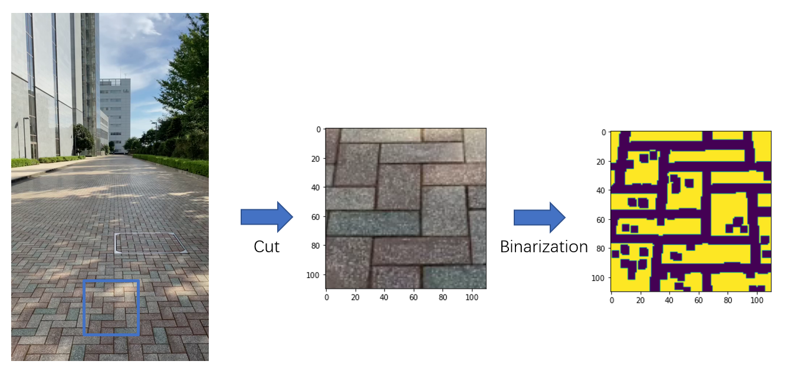
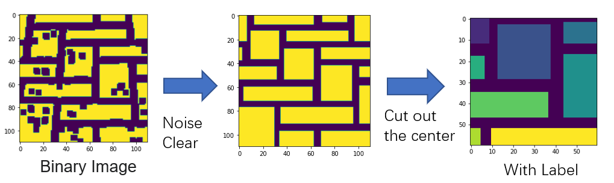

# Brick

This is to use the pixel change of the brick to get the moving distance

## How to Use

Download :

`git clone https://github.com/bluewhitep/brick.git`

See the `/python` directory for Use

## How to work

## Example Video

# Copyright

* See the `LICENSE` file

Guard object of logger for debugging.
Copyright (c) 2021 bluewhite <lostsilverwing@gmail.com>

